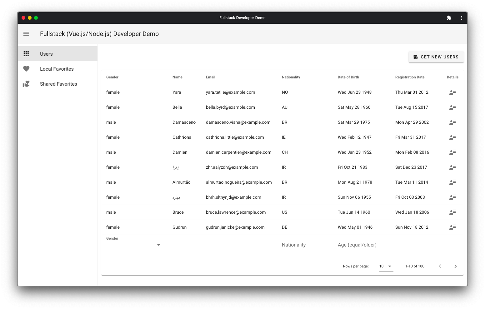

# A frontend demo built with Nuxt and Vuetify

> A frontend (Vue.js) developer demo that connects to a custom REST API you can find here: https://feathers-microservice-demo.herokuapp.com/ and, to the https://randomuser.me/ public API.

## Live version

Check a [live version](https://nuxt-vuetify-pwa-demo.herokuapp.com/) deployed on the [Heroku Cloud Application Platform](https://www.heroku.com/).



https://nuxt-vuetify-pwa-demo.herokuapp.com/

## About

This project uses [Nuxt](https://nuxtjs.org/). An open source framework to develop with simplicity and deploy with confidence. Nuxt is built on top of Vue.js (Vue.js is described as a progressive framework but, in my opinion, it is more a collection of libraries; Nuxt is a more robust framework for developers.)

I've made an extensive use of the latest version of [ECMAScript](https://en.wikipedia.org/wiki/ECMAScript) and, used a few cool modern development techniques and tools like: [Docker](https://www.docker.com/), [Node.js](https://nodejs.org/), [npm](https://www.npmjs.com/), [yarn](https://yarnpkg.com/), [Axios](https://axios-http.com/), [Nuxt PWA](https://pwa.nuxtjs.org/), live code reload on development, support for SSR, linters for JavaScript and CSS, [Vuetify](https://vuetifyjs.com/), transpiling Javascript with [Babel](https://babeljs.io/)… to name some of the most relevant ones.

And, of course, I’ve used [Git](https://git-scm.com/) for code control version and, a basic knowledge of the [Unix Shell](https://en.wikipedia.org/wiki/Unix_shell) for interacting with the respective [CLI (command-line interface)](https://en.wikipedia.org/wiki/Command-line_interface) for Git, Docker and, Feathers. The full project has been developed on [macOS](https://www.apple.com/es/macos/what-is/) [Catalina](https://en.wikipedia.org/wiki/MacOS_Catalina) (v10.15.6) on top of a [MacBook Air mid 2012](https://support.apple.com/kb/SP670?viewlocale=en_US&locale=es_ES).

## Project introduction

Implement a Progressive Web Application (PWA) that displays user profiles randomly generated by the public [Random User API](https://randomuser.me/).

### First part (frontend/Vue.js) implementation requirements

- The main view of the page must present a query of maximum 100 profiles.
- The profiles on the main view may be filtered by: gender, age and nationality.
- The application must allow to select a profile and display it in a separate view.
- A profile can be marked/deleted as a favorite.
- Favorite profiles can be listed and exported to a CSV file with the following data: gender, name, email, nationality, date of birth, date of registration.
- The design of the application must follow "Material Design" guidelines.

### Second part (backend/Node.js) implementation requirements

Implement a microservice that allows the user to share his own list of favorite user profiles (previouly choosen using the PWA UI). So at the end the list will be published in a separated service.

- The microservice should receive a list of favorite profiles.
- The microservice must expose an endpoint to query the saved lists.
- Each list must be saved with a nickname that the user provides when creating it.
(modify the PWA to integrate this functionality).
- Store the lists in memory.

## Quick start with Docker

You need [Git](https://git-scm.com) >= `v2.24.3` and, [Docker Engine](https://docker.com/) >= `v19.03.13`. Make sure you don't have any other service using the 3000 port.

```bash
$ git clone https://github.com/josepcrespo/nuxt-vuetify-pwa-demo.git && cd nuxt-vuetify-pwa-demo && docker-compose build --no-cache --force-rm && docker-compose up
```

The PWA will be available at [http://localhost:3000](http://localhost:3000)

## Local setup (if don't want a Docker setup)

```bash
# install dependencies
$ yarn install

# serve with hot reload at localhost:3000
$ yarn dev

# build for production and launch server
$ yarn build
$ yarn start

# generate static project
$ yarn generate
```

For detailed explanation on how things work, check out [Nuxt.js docs](https://nuxtjs.org).
